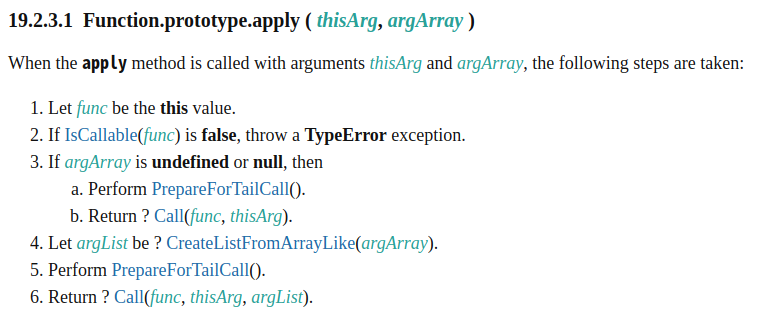

这里我们来聊一聊作用域, this 指向的区别，还有 手动绑定 this 指向的方法

<!--truncate-->
## 什么是作用域

作用域我们在聊关键字[var/let/const](./var-let-const.md)的时候也有说过， 作用域是用来指定变量/函数可供访问的范围,即变量/函数被定义和访问的范围及关系。

js是词法作用域，也叫做静态作用域,前面说过 js 有以下作用域

* 全局作用域: window/global

* 函数作用域

* 块级作用域(ES6 -- let/const)

简单来说js的词法作用域就是在 js 进行语法词法分析的时候就确定的作用域 , 这里面就涉及到前面文章说过的`变量提升`等概念了

## 关键的 this

this 关键字在 js 编程中经常被使用，而且因为在不同场景下表现存在差异，很容易出现 bug , 所以我们来讨论下

首先我们先区分作用域和 this，简单来说如下
> 作用域在 js 语法分析的时候就已经确定
> this 的指向是根据调用函数运行的上下文动态确定的

前面说到，this 的指向和`调用函数`存在关系,下面总结下几种关系

* 在函数体中，简单调用函数，this 绑定到全局对象`window/global`,如果是在严格模式下，this 绑定到 undefined
* 通过 new 调用的函数，this 会绑定到新创建的对象上
* 根据上下文对象调用，绑定在该对象上
* 通过 call/apply/bind 调用，绑定到指定参数的对象上
* 如果是箭头函数，则会根据外层上下文绑定的 this 决定 this 指向

总结下, 除了箭头函数之外，其他情况下与调用方式相关, 而箭头函数则与完成的上下文绑定的 this 相关，看以下例子

``` javascript

const o1 = {
   t1:'text',
   fn1:function() {
      setTimeout((){
         console.log(this.t1);
      });
   }
}

o1.fn1(); // print undefined , this -> window

```

上面例子中 setTimeout 是匿名函数，this 指向 window

如果改成

``` javascript

const o1 = {
   t1:'text',
   fn1:function() {
      setTimeout(() => {
         console.log(this.t1);
      });
   }
}

o1.fn1(); // print text, this -> o1

```

setTimeout 匿名函数是箭头函数，箭头函数的 this 指向由上层 fn1的 this 绑定来确定

再看下面的问题

``` javascript
const o1 = {
   t1:'text',
   fn1:function() {
      setTimeout(()=>{
         console.log(this.t1);
      },0);
   }
}

const o2 = {
   t1:'text2',
   fn1: o1.fn1
}

o2.fn1(); // print text2 , this -> o2

```

首先 `o2.fn1`指向`o1.fn1`,而调用 `fn1` 是在 `o2` ,因此 `fn1` 此时绑定的 `this` 是 `o2`, 而又如前面的箭头函数，因此 `setTimeout` 的 `this` 指向 `o2`

## call/apply/bind

前面我们讨论了 this 指向问题, 上面的都是根据规则被动绑定的 this 指向，那么如果我们要怎么进行主动的 this 指向绑定呢，这时候就会用到 `call`、`apply`、`bind` 这个方法来进行绑定，
这三个方法的关注点都是在`函数this 指向` 上面，从作用上面都是重新绑定函数的this 指向, 方法之间略微有些差别

### call/apply

`call` 和 `apply` 有点相似，都是直接执行对应的函数，通过传入的第一个参数指定函数运行时候的 this 指向，区别在与第一个参数后的参数， `call` 为逐个传入参数，`apply` 则是通过数组一次性传入参数

``` javascript
function foo(a,b,c,d){
   console.log(this.tt);
   console.log(a,b,c,d);
}

foo(1,2,3,4); // print undefined | 1,2,3,4   this-> window

foo.call({tt:123}, 1,2,3,4); // print 123 | 1,2,3,4  this -> {tt:123}

foo.apply({tt:123},[1,2,3,4]);// print 123 | 1,2,3,4 this -> {tt:123}

```

#### call/apply 性能上有什么区别

* 根据 [ecma 262 标准](https://tc39.es/ecma262/#sec-function.prototype.apply)，里面描述的`apply` 执行步骤如下:
  
     

   可以直接看`step 3 和 6`, 可以发现其实`apply` 是封装了`call` 的调用，因此理论上来说 `call` 的性能要比 `apply` 的好，**不过在现代浏览器中，这个差别微乎其微**；对于一些老旧的浏览器，有一个说法是如果你的参数列表长度小于`3` ,则直接使用`apply` ,如果大于`3` ,则将参数对应传入`call` 中，性能会更加好

### bind

`bind`的作用也是通过第一个参数指定函数 this 的指向，与`call`、`apply`不同的是，`bind`不直接运行函数，而是返回一个函数, 第一个参数后的参数会指定原函数对应函数的参数值, 返回的函数的参数会补充到原有参数列表的后面, 因此`bind` 也用于生成偏函数

``` javascript
function add(a,b,c){
     console.log(this);
    return a+b+c;
}

add(1,2,3); // print window | 6  this -> window

add1 = add.bind({a:1});
add1(1,2,3); // print {a:1} | 6 this -> {a:1}

add2 = add.bind({a:2}, 1,2);

add2(1,2,3); // print {a:2} | 4(1+2+1) this -> {a:2}  偏函数

```

### bind/call/apply 混用

简单来说就是一个函数调用了`bind`生成了新函数，然后又用`call`、`apply`进行调用，如果传入的作用域不一致，会以哪个为准，结论就是以 bind 的传入作为 this 的指向

``` javascript
function foo() {
   console.log(this.a)
}
foo.bind({a:1}).call({a:2}); // print 1
```

### 手写一个 bind

通过重写`Function.prototype.bind`就可以重写 `bind`, 通过封装调用 `apply`来实现

``` javascript
Function.prototype.bind = function (thisContext, ...oargs) {
  const fn = this;
  return function (...args) {
    fn.apply(thisContext, [].concat(oargs, args));
  };
};
```

进阶，不能使用原生的`apply`、`call` , 如何实现

那我们就应该去实现`apply` 了，apply 怎么去实现呢，我们可以按照上面的隐式 this 绑定规则，构造出来对应的函数执行环境

``` javascript

Function.prototype.apply = function (thisContext, args) {
  thisContext = thisContext? Object(thisContext): window // window/global;
  thisContext.fn = this;
  const result = thisContext.fn(...args);
  delete thisContext.fn;
  return result;
};

```

可以看到我们应用了 `根据上下文对象调用，绑定在该对象上` 这个规则，将`this`值构造出来Object `thisContext`,添加函数作为`thisContext.fn`,然后执行，将函数的 this 绑定在`thisContext` 上面
